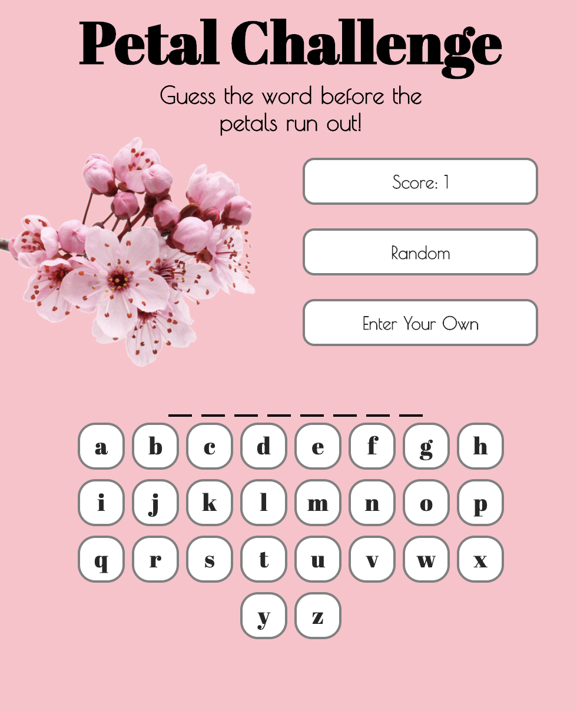

# Hangman
## Goal

To create an online nonviolent version of the 'hangman' word game

## Languages Used
* HTML
* CSS
* JavaScript

## Installation

Fork and clone this repository. Open the index.html file in your browser to play the game! Or, check out the deployed version at [Petal Challenge](https://torykling.github.io/Hangman/)!

## How to Play

Use your keyboard or the buttons provided on the screen to guess a letter in the mystery word. If you guess correctly, the letter will appear onscreen. If your guess is incorrect, the flower pictured will lose some of its petals. Fill in the blanks before the flower disappears and you score a point!

If playing with a friend, you can press 'Enter Your Own' to enter a mystery word of your choice or press 'Random' to have a word chosen for you.

## Challenges

Finding an appropriate word list was a challenge. I ended up taking a GRE prep excel word list and using a data converter to create a random word array.

Font sizing was a challenge since the user can enter their own mystery text. I set the whitespace to nowrap to ensure words would not get cut up when wrapping onto the next line. Unfortunately this means the user has to scroll over on mobile if they enter a long string of text in the 'Enter Your Own' input field.

Initially the images were taking too long to load on mobile, so they had to be resized.

## Next Steps

Ideally I'd like to allow the user to choose from several themes and to select a level of difficulty that would pull random words from different lists. 

I also want to update the game logic to allow the user to enter special characters in the input field.
